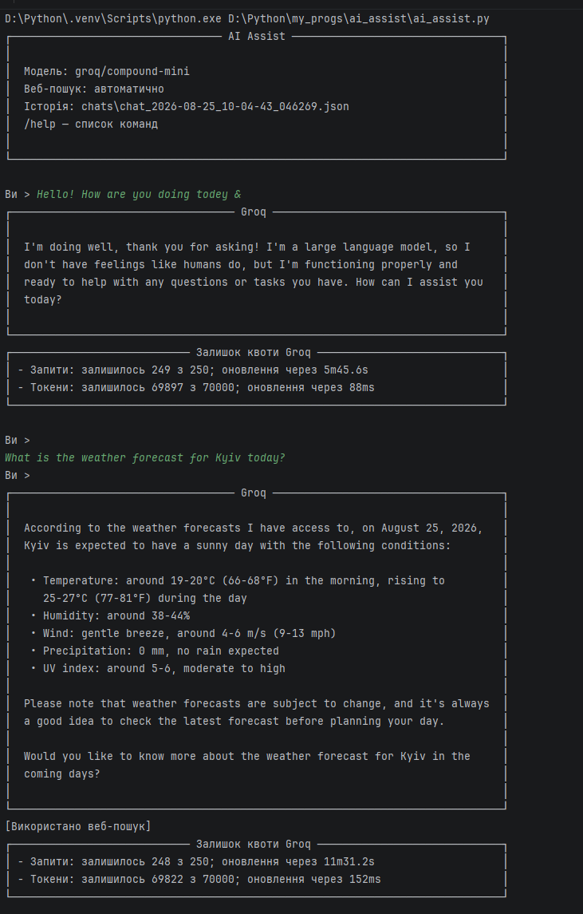

# AI Assist

[Українська версія](README.uk.md)

A terminal-based AI assistant written in Python and powered by Groq Compound Mini. It combines a chat interface with automatic web search, source display, rate-limit feedback, local chat history, and safe text extraction from selected local documents.

> This is a portfolio pet project. It demonstrates practical Python development, API integration, error handling, local persistence, and terminal UI design.



## Features

- interactive terminal chat with a Rich-based interface and Markdown replies;
- current date included in the system prompt for clearer relative dates;
- automatic live web search when Groq Compound Mini decides it is needed;
- up to five web-search sources displayed after a response;
- API rate-limit details read from Groq response headers when available;
- bounded conversation context to reduce oversized-request errors;
- rotating diagnostic logs that never store prompts, replies, or API keys;
- automatic local JSON chat history;
- explicit, confirmed local-file processing for text documents and spreadsheets.

## Supported file processing

Run `/file` before attaching a file to see the formats, limits, and privacy notice. The app asks for confirmation before it reads a local file.

| Format | Processing |
| --- | --- |
| `.txt`, `.md`, `.py`, `.json`, `.csv`, `.log`, `.yaml`, `.yml`, `.xml`, `.html` | Reads text or source code. |
| `.pdf` | Extracts the existing text layer. Scanned PDFs without OCR are not supported. |
| `.docx` | Extracts paragraphs and table cells. |
| `.xlsx` | Extracts cell values from up to 200 non-empty rows. |

File limits: **5 MB** per file and **4,500 characters** of extracted text sent to the model. The original file is not uploaded as a Groq attachment; the app extracts bounded local text and sends that text with the next prompt. Images, audio, and video are not supported by the current `groq/compound-mini` text workflow.

Do not attach secrets or sensitive personal data: extracted text is sent to Groq and stored in the local chat JSON file.

## Requirements

- Python 3.10 or newer;
- a Groq account and API key;
- an internet connection.

## Installation

```powershell
git clone https://github.com/<your-username>/ai-assist.git
cd ai-assist
python -m venv .venv
.\.venv\Scripts\Activate.ps1
python -m pip install -r requirements.txt
Copy-Item .env.example .env
```

Open `.env` and add your key without quotation marks:

```env
GROQ_API_KEY=your_groq_api_key
GROQ_MODEL=groq/compound-mini
SYSTEM_PROMPT=You are a helpful and accurate assistant.
```

Run the assistant:

```powershell
python ai_assist.py
```

## Commands

| Command | Description |
| --- | --- |
| `/help` | Show all commands. |
| `/clear` | Start a new conversation and a new history file. |
| `/history` | List the ten most recently saved chats. |
| `/file` | Show supported formats and upload limitations. |
| `/file <path>` | Prepare a local file for the next prompt after confirmation. |
| `/remove-file` | Remove a prepared file before sending a prompt. |
| `/exit`, `/quit`, `/q` | Exit the application. |

Example:

```text
You > /file "D:\Documents\report.pdf"
Read this file and prepare it for Groq? [y/N] y
(OK) File prepared.

You > Summarize the document and list its three main risks.
```

## Project structure

```text
ai-assist/
├── ai_assist.py              # Terminal application and Groq integration
├── config.py                 # Minimal .env loader and configuration
├── requirements.txt          # Runtime dependencies
├── requirements-dev.txt      # Test dependencies
├── .env.example              # Safe configuration template
├── tests/                    # Offline unit tests
├── .github/workflows/tests.yml
├── assets/screenshots/       # README screenshots
├── chats/                    # Local chat history, ignored by Git
└── logs/                     # Local diagnostics, ignored by Git
```

## Tests

The test suite does not call Groq or require an API key.

```powershell
python -m pip install -r requirements-dev.txt
python -m pytest
```

GitHub Actions runs the tests automatically on Python 3.11 and 3.12 for pushes and pull requests.

## Privacy and security

- Keep your real key only in `.env`; it is excluded from Git.
- `chats/`, `logs/`, caches, and the original screenshot file are excluded from Git.
- Diagnostic logs contain technical events only, not message contents or API credentials.
- Chat JSON files contain conversation text and are not encrypted.

## Limitations

- Groq model availability, web-search behavior, and free-tier limits can change.
- The app displays the quota window returned by the API, which may not equal a daily balance.
- `/history` lists prior chats; loading a previous chat into a new session is not implemented yet.
- Large files are intentionally truncated before being sent to the model.

## Roadmap

- [ ] Load and continue a saved chat with `/load`.
- [ ] Export a chat to Markdown or plain text.
- [ ] Add `/quota`, `/sources`, `/retry`, and `/undo` commands.
- [ ] Enforce a total context-size budget instead of only per-message limits.
- [ ] Add retry with exponential backoff for temporary API failures.
- [ ] Add an optional Ollama backend for local Qwen/Gemma models.
- [ ] Add image analysis through a separate Groq vision model.
- [ ] Split the application into dedicated UI, history, and API modules.

## License

Distributed under the [MIT License](LICENSE).
